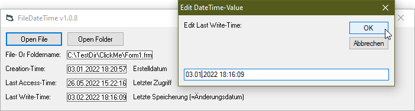

# Date_FileDateTime
## Class for reading and writing time-infos to files or folders

project started in may 2022.  
Class PFNDateTime is an extension to class PathFileName.
Now it is possible to read and write creation-time, last-access-time and last-write-time to and from files and folders
Last-write-time is the time (Änderungsdatum) you normally get to see in windows file explorer.

